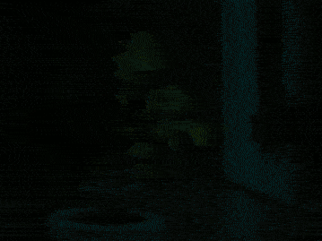

# timelapse
[![Build Status][ci-badge]][ci-url]

Python library for creating time-lapse videos.

Example: Lettuce growing for one day, imaged every ten minutes and played back at 24 FPS.



---

## Installation
If you have not already, check out the repository:
```
git clone https://github.com/eskaur/timelapse.git
```
Then, install by pointing `pip` to the repository root directory:
```
python -m pip install ./timelapse
```
If you plan to make changes to the library itself, consider 
adding `--editable` to the install command.

---

## Capturing timelapse images
Create a directory for storing captured images, e.g.:
```
mkdir my-timelapse-images
```
Then, launch the timelapse capture process by setting this directory as destination:
```
python -m timelapse.launch --destination ./my-timelapse-images/ --interval-minutes 5 
```
In this example, it will capture one image every five minutes. A log file will be created
in a directory called `logs` under the current working directory.

---

## Creating a timelapse video
Given that the images were stored in the directory used in the example above,
a timelapse video may be created with:
```
python -m timelapse.process --input-dir ./my-timelapse-images/ --fps 10
```
In this example, the video will play at a rate of ten frames per second.
The video will be created in the current working directory, unless overridden by the
`--output-dir` argument.


[ci-badge]: https://img.shields.io/github/workflow/status/eskaur/timelapse/Main%20CI%20workflow/master
[ci-url]: https://github.com/eskaur/timelapse/actions?query=workflow%3A%22Main+CI+workflow%22+branch%3Amaster

